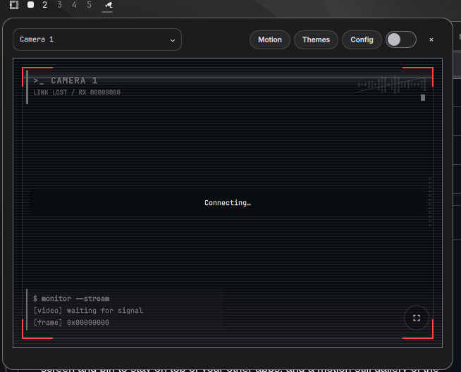

# RTSP Camera for Omarchy

Bar plugin for [Omarchy](https://omarchy.org) that
shows RTSP camera feeds in a themed, pinnable card on your desktop.



---

## What it does

- **Bar widget** — camera icon on the right side of the Omarchy bar. Click to
  open the viewer; click again or click outside to close (unless pinned).
- **Profiles** — save up to 32 cameras (name + RTSP URL + credentials). Switch
  from the dropdown in the header. The last camera is remembered across
  monitors.
- **Viewer** — resizable card (drag corners; double-click to reset). Size and
  per-monitor pinned position persist under `~/.config/rtsp-camera/`.
- **Pin** — switch stays above other windows; drag the empty header to move it.
  Chrome fades when the pointer leaves; hover brings it back. Pin resets on close.
- **Streaming** — audio starts muted (waveform toggle), auto-reconnect with
  backoff (2→30s), corner borders go red while offline/connecting. **⛶** is
  fullscreen (Esc exits).
- **Themes** — live preview of video styles (Original / Omarchy / Pixel /
  Omarchy Pixel) and overlays (Default / Coder / Hackerman). **Apply** saves
  for every camera; dismissing the section discards unapplied changes.
- **Motion** — gallery of still frames from the last 24h (see below).

Settings live in `$XDG_CONFIG_HOME/rtsp-camera/` (typically
`~/.config/rtsp-camera/`). Camera passwords are mode-0600; credentials go to
the save helper over stdin, never on the command line. RTSP is not encrypted —
prefer RTSps if your camera supports it.

---

## Design changes

UI/UX only — same streaming model and settings format as upstream.

| Area | Change |
|------|--------|
| **Header** | Camera selector → **Motion** → **Themes** → **Config** → pill pin switch → round **×** close. |
| **Fullscreen** | Only bottom-right **⛶** on the video; removed from the header. |
| **Themes entry** | First-class **Themes** button in the header (replaces the old palette icon). |
| **Pill controls** | Motion / Themes / Config / pin use Omarchy `Controls.Button` with rounded hover fills. |
| **Dropdowns** | Camera, video style, and overlay popups: radius 10/12, themed row hover, caption fonts. |
| **Labels & status** | Theme editor and messages use Omarchy’s font family and caption sizing. |
| **Tooltips** | Drag/resize use `PanelToolTip` (subtle shell style), not default Qt chrome. |
| **Cursors** | `PointerArea` sets the correct pointer on buttons, dropdowns, sliders, gallery tiles. |
| **Pinned chrome** | Forced visible while a dropdown is open so the popup isn’t cut off against a faded card. |
| **Motion page** | Gallery is a third stack view (live / config / motion) under the same header. |

---

## Functionality changes

- **Motion still gallery** — `Motion` / `Live` in the header. `motiond.py`
  captures via ONVIF PullPoint (HTTP snapshot fallback). Files in
  `~/.local/share/rtsp-camera/motion/` (0700), pruned at **24h** or **400
  files**. Retention/camera in `motion.json` (0600). Optional user unit:
  [`contrib/yani-camera-motion.service`](contrib/yani-camera-motion.service).

  ```sh
  cp contrib/yani-camera-motion.service ~/.config/systemd/user/
  systemctl --user daemon-reload
  systemctl --user enable --now yani-camera-motion.service
  ```

  Without the service you can still browse stills already on disk; opening
  **Motion** only lists files, it does not start the loop.

- **Stream pauses for the gallery** — player tears down while Motion is open;
  **Live** reconnects.

- **Auto-bind** — first run binds the gallery to the selected camera
  (`selectedId`), else the first profile.

- **Pinned input mask** — `CameraPopup.extraInput` is unioned into the
  layer-shell `Region`, so dropdown rows that hang past the card stay
  clickable while pinned. Mask clears when all popups close.

- **`chromeForce`** — driven by any combo popup `opened` (and card move).

- **`Controls.Button`** — pill buttons import `QtQuick.Controls as Controls`
  so they aren’t shadowed by Omarchy’s `qs.Ui.Button` (no `contentItem` /
  `hovered`).

- **Tests** — `test_motiond.py` (prune/list/creds, no network) + existing
  `test_config.py`. `.gitignore` also excludes `motion.json`,
  `appearance.json`, `position-*.json`, `.profiles.lock`, `.status.json`.

---

## Requirements

- Omarchy 4 (Quickshell plugin system)
- Qt 6 Multimedia + backend (e.g. `qt6-multimedia-ffmpeg`)
- Python 3 (stdlib only)
- RTSP/RTSps camera; for motion: ONVIF or HTTP snapshot + optional user service

Tested: Omarchy 4.0.3, Quickshell 0.3.1, Qt 6.11.2. Runs inside the shell
process; no root, no runtime downloads. Motion service is opt-in.

---

## Install

```sh
omarchy plugin add https://github.com/santidsds/santidsds-rtsp-camera.git --enable
```

Upstream original:

```sh
omarchy plugin add https://github.com/Yani3rt/rtsp-camera-plugin.git --enable
```

First open → **Config** → name + `rtsp://…` + user/password → **Save &
connect**. Example only: `rtsp://192.0.2.10:554/stream`. Put credentials in
the fields, not in the URL.

Update a git install: `omarchy plugin update yani.camera`

**Local dev:** copy this tree to `~/.config/omarchy/plugins/yani.camera/`
(including `shaders/` and license files), then
`omarchy-shell shell rescanPlugins` and
`omarchy plugin enable yani.camera --section right`.

---

## Themes (video style & overlay)

Open **Themes** from the header. Changes preview live; **Apply** saves for
all cameras/monitors (`appearance.json`). Closing the viewer or opening
Config discards unapplied edits.

| Video style | Look |
|-------------|------|
| **Original** | No filter / no effect texture. |
| **Omarchy** (default) | Soft blend into the current Omarchy palette. |
| **Pixel** | Crisp blocks, original colors (size 1–16 px, default 3). |
| **Omarchy Pixel** | Pixel blocks + theme tint. |

Themed styles add **Tint strength** (0–100%, default 35%). Pixel styles add
**Pixel size**.

| Overlay | Adds |
|---------|------|
| **Default** | Corner borders + waveform mute. |
| **Coder** | + activity dots + terminal status / frame counter. |
| **Hackerman** | + scanlines, sweep band, top header, block cursor. |

Borders are red offline/connecting, accent when frames arrive. Overlays fit
the video (letterbox untouched), sit under playback controls, and use one GPU
texture + one shader — no per-frame Python. Needs a working Qt Quick GPU
backend for filtered styles.

---

## Verify

```sh
omarchy plugin validate .
python3 -m unittest discover -s . -p 'test_*.py'
python3 tests/run_qml_checks.py --ui-only   # layout; full run needs FFmpeg/QtTest
```

Rebuild the shader after editing `shaders/video.frag`:

```sh
/usr/lib/qt6/bin/qsb --glsl '100 es,120,150' --hlsl 50 --msl 12 \
  -o shaders/video.frag.qsb shaders/video.frag
```

---

## Disable / remove

```sh
omarchy plugin disable yani.camera    # keep settings
omarchy plugin remove yani.camera     # remove plugin; settings remain
```

To wipe data, delete `~/.config/rtsp-camera/` and
`~/.local/share/rtsp-camera/`. If you installed motion:
`systemctl --user disable --now yani-camera-motion.service` and remove the
unit from `~/.config/systemd/user/`.

---

## Credits / fork

**This repo:** [santidsds/santidsds-rtsp-camera](https://github.com/santidsds/santidsds-rtsp-camera)

Based on [`Yani3rt/rtsp-camera-plugin`](https://github.com/Yani3rt/rtsp-camera-plugin)
by **Yani (Yaniert Pascual)** — original RTSP bar widget, multi-camera
profiles, pinnable/resizable viewer, reconnect, themes, and overlays.

I (**Santiago Da Silva / santidsds**) interactively adapted that codebase:
header/control redesign, motion gallery + listener, Omarchy button-type
fixes, pinned input mask, and documentation. Design and functionality changes
in this fork are mine; the original work remains Yani’s. Published under the
same MIT license without claiming upstream authorship.

Upstream-only install is linked above under **Install**.

---

## License

[MIT](LICENSE).

- Original © **Yani (Yaniert Pascual)** — [`Yani3rt/rtsp-camera-plugin`](https://github.com/Yani3rt/rtsp-camera-plugin)
- This fork’s design & functionality changes © **Santiago Da Silva (santidsds)**
- Adapted Omarchy popup attribution: [THIRD_PARTY_NOTICES.md](THIRD_PARTY_NOTICES.md)

Showcase screenshot is from this fork. Marketplace notes: [PUBLISHING.md](PUBLISHING.md).
